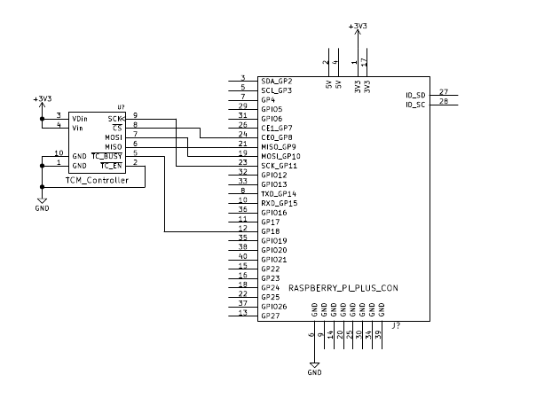

# Python library for TCMP e-ink displays

Python library supporting [Pervasive Displays'](http://www.pervasivedisplays.com/) TCMP series of e-ink development
kits on Raspberry Pi or similar embedded linux boards.

This has been built and tested with a [mpicosys441](http://www.pervasivedisplays.com/kits/mpicosys441) development kit, but should 
also work with the 10.1" kit. The 7.41" display uses a different pixel format
and is not currently supported.

### Credits

Although this library is not a direct fork, it is very heavily based on
Adafruit's [library](https://github.com/adafruit/Adafruit_Python_SSD1306) forthe [SSD1306 OLED displays](https://www.adafruit.com/category/98).


## Usage

### Installation

This library relies on [Adafruit's Python GPIO](https://github.com/adafruit/Adafruit_Python_GPIO) which I had to install from
git in order to get working platform detection.

The pillow fork of PIL is also required.

This library does not currently have a setup.py so needs to be used from src.

### Connecting the display

The diagram below shows the display connected to the hardware SPI bus on a
Raspberry Pi (new GPIO layout). GPIO 18 is used for the busy signal from the
display - this can easily be changed but GPIO 18 is used in the examples.



### Example 1: shapes.py

This is a copy of the shapes.py example from Adafruit's [tutorial for the OLED
displays](https://learn.adafruit.com/ssd1306-oled-displays-with-raspberry-pi-and-beaglebone-black).

With this display controller, only SPI is supported, not I2C.

The api is very similar, the main difference being that `display.image` is a
attribute not a function so that:

```python
disp.image(image)
```
Becomes:

```python
disp.image = image
```

And the PIL image can be retrieved later.

> Note:
> The image attribute stores a copy of the assigned image so changes to the
> original will not be picked up automatically.

### Example 2: display_image.py

This example when run as a script loads the image from the file name given as
the first argument (assuming it is supported by PIL), scales it, converts it to
1 bit black and white and then displays it on the attached display.


## TODOs:

 - [ ] add a walkthrough/tutorial
 - [ ] better diagram
 - [ ] add a timeout to the busy wait
 - [ ] support the "type 4" pixel format for the 7.4" displays
